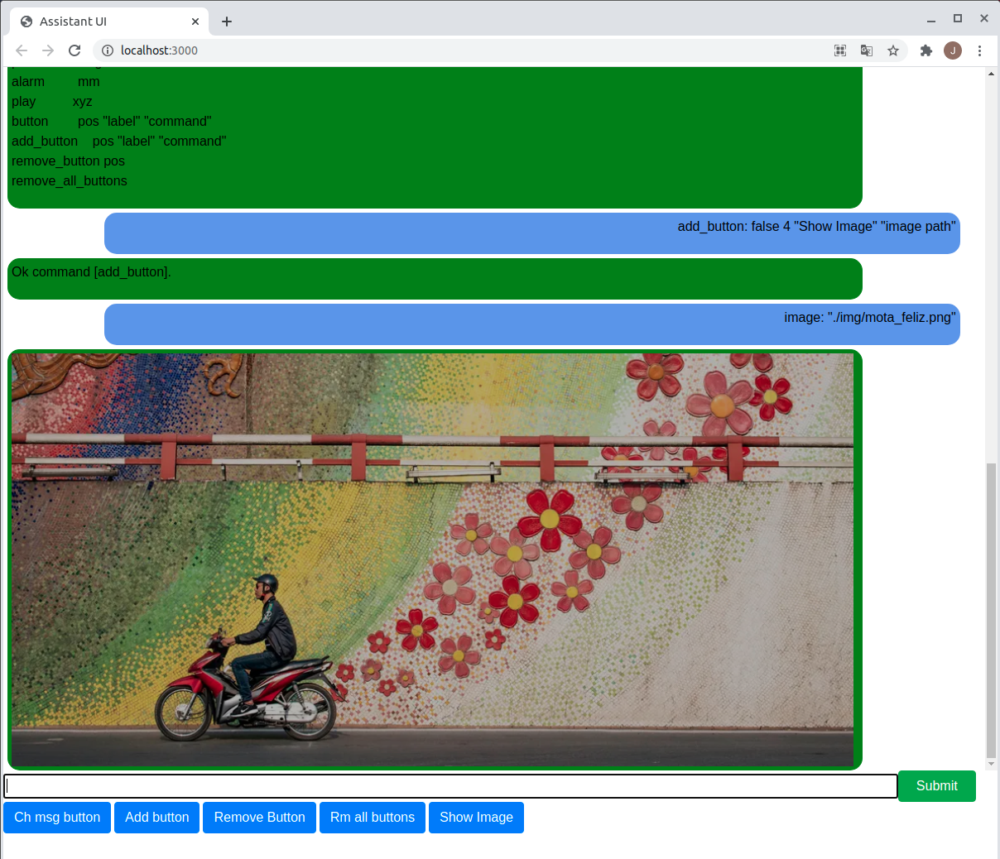

# React - Command Assistant UI
A simple GUI React project with a command type interface, to enable interaction with a server.

## Description
This is a simple React web project made in Javascript. It gives the initial frame for a command GUI to interact with a Raspberry Pi server. This is only the React part, and is a work in progress.  
 
The UIX experience is a command and response kind of interactions, with a history scroll of past commands, a history on the command it self, like a shell history and a group of configurable buttons to execute the commands in one go. Or to write the command skeleton in the text box.  

## UI image

## References
* React documentation  
  [https://reactjs.org/docs/getting-started.html](https://reactjs.org/docs/getting-started.html)

## License
MIT Open Source License.

## Have fun
Best regards,  
João Nuno Carvalho
